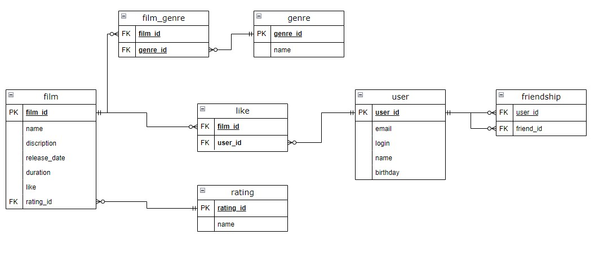

# Filmorate app

## Endpoints
### Film
- `[GET] /films` — get all films
- `[GET] /films/{id}` — get film by id
- `[POST] /films` — creat a film
- `[PUT] /films` — update a film
- `[DELETE] /films` — delete a film
- `[PUT] /films/{id}/like/{userId}` — add a like to a film
- `[DELETE] /films/{id}/like/{userId}` — remove a like from a film
- `[GET] /films/popular` — get popular films
### User
- `[GET] /users` — get all users
- `[GET] /users/{id}` — get user by id
- `[POST] /users` — creat a user
- `[PUT] /users` — update a user
- `[DELETE] /users` — delete a user
- `[PUT] /users/{id}/friends/{friendId}` — add a user as a friend
- `[DELETE] /users/{id}/friends/{friendId}` — remove a user from friends
- `[GET] /users/{id}/friends` — get a list of all the users friends
- `[GET] /users/{id}/friends/common/{otherId}` — get a list of common friends of users
### Mpa
- `[GET] /mpa` — get all mpas
- `[GET] /mpa/{id}` — get mpa by id
### Mpa
- `[GET] /genres` — get all genres
- `[GET] /genres/{id}` — get genre by id

## Database Schema

